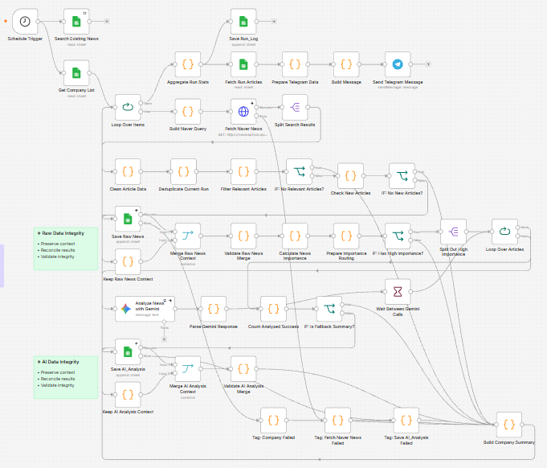

# News Automation

국내 주요 산업의 상장기업 뉴스를 자동으로 수집하고, AI가 구조화하여 Google Sheets에 축적하는 개인 프로젝트입니다.

이 프로젝트는 자동매매 시스템이 아니며, 특정 개인의 보유 종목을 위한 도구도 아닙니다. 목표는 산업 대표기업 중심의 뉴스 인텔리전스 데이터셋을 지속적으로 쌓아 향후 분석에 활용하는 것입니다.

## Workflow Overview

아래는 실제 실행된 프로덕션 워크플로우의 n8n 캔버스입니다. 초록 체크는 정상 완료된 노드, 각 화살표의 숫자는 해당 구간을 실제로 통과한 아이템 수입니다 — 다이어그램이 아니라 실행 결과 스크린샷입니다.



50개 노드로 구성되어 있으며, 단순 수집을 넘어 회사 단위 오류 격리·저장 데이터 무결성·실행 로그·기사 단위 재시도까지 포함합니다.

## 주요 기능

- 하루 1회 관심기업(Companies 시트에서 관리) 관련 뉴스 자동 수집 (NAVER Search API)
- URL 해시 기준 중복 제거
- AI 요약 및 이벤트 분류 (구조화된 JSON)
- Google Sheets에 원본(Raw_News)과 AI 분석(AI_Analysis) 데이터 분리 저장
- 회사당 반드시 1개의 처리 결과가 남도록 보장하는 오류 격리
- 실행 결과를 Run_Log에 기록 (실행당 정확히 1행)
- 실행 종료 후 Telegram으로 일일 요약 알림 발송

## 핵심 설계

- **Company 단위 오류 격리** — 관련 기사 0건, API 실패 등 모든 경우에도 회사당 정확히 1개의 결과가 남도록 보장
- **Raw_News / AI_Analysis 분리** — 원본과 AI 분석 결과를 분리 저장해 재분석 시에도 원본은 항상 보존
- **AI 호출 전 중요도 필터링** — 규칙 기반 점수로 후보를 먼저 줄여 Gemini API 호출을 최소화
- **Fork + Merge 기반 데이터 무결성** — 저장 단계의 필드 유실 문제를 원본 보존 + 재결합으로 해결, 불일치 시 명시적 에러 발생
- **Run_Log 무결성 판정** — 집계가 어긋나면 조용히 넘어가지 않고 FAILED로 판정
- **Telegram 일일 요약** — 산업별 그룹화와 Priority 상위 기사 발췌로 실행 결과 요약 발송
- **기사 단위 순차 재시도** — Gemini API 호출을 회사당 배치가 아니라 기사 1건 단위로 순차 처리해, rate limit 발생 시 실패한 기사만 정확히 재시도되도록 보장
- **무인 실행 신뢰성** — 로컬 환경(Windows 절전/최대절전)에서도 재시작 없이 안전하게 배포하고 트리거를 재무장하는 운영 구조

각 설계의 배경과 근거는 [docs/design.md](./docs/design.md) 11절 "설계 결정"을 참고하세요.

## 시스템 아키텍처

```
Schedule Trigger (매일 1회)
  → Companies 조회 (active=TRUE)
  → 기업별 Loop
      NAVER Search API 검색 → 관련성 필터 → 신규/중복 판별
      → Raw_News 저장 → 중요도 필터 → Gemini 분석 → AI_Analysis 저장
      (오류 격리로 항상 회사당 결과 1개 보장)
  → 실행 통계 집계 → Run_Log 저장 → Telegram 요약 발송
```

전체 아키텍처와 각 단계의 설계 근거는 [docs/design.md](./docs/design.md) 3절·8절을 참고하세요.

## 기술 스택

- **n8n** — 워크플로우 자동화
- **Gemini API** — AI 기반 뉴스 요약 및 이벤트 분류 (무료 티어)
- **Google Sheets API** — 데이터 저장
- **Telegram Bot API** — 실행 완료 알림
- **Docker / WSL2** — 실행 환경

세부 모델 및 API 스펙은 [docs/design.md](./docs/design.md)에서 관리합니다.

## 데이터 저장 구조

Google Sheets 4개 탭에 역할을 분리해 저장합니다.

- Companies
- Raw_News
- AI_Analysis
- Run_Log

초기 Companies 데이터는 `seed/companies_seed.csv`로 채울 수 있으며, 컬럼 단위 상세 스키마는 [docs/design.md](./docs/design.md) 5절을 참고하세요.

## 재현 참고

완전한 설치형 오픈소스가 아니라 개인 운영 중인 자동화 파이프라인입니다. `n8n/workflows/news-collector.json`은 **참고용 export**이며, credential 재연결과 환경별 설정 없이는 바로 실행되지 않습니다.

**필요한 것**
- n8n 인스턴스
- Google Cloud 서비스 계정 (Google Sheets API)
- Gemini API 키
- NAVER Search API 키
- Telegram Bot

**설정 방법**
- workflow import 후 credential 4개(Google Sheets / Gemini / NAVER / Telegram)를 각자 환경에 맞게 재연결하고, Google Sheets `documentId`와 Telegram `chatId`를 재설정해야 합니다.
- Google Sheets 스키마는 [docs/design.md](./docs/design.md) 5절에 문서화되어 있습니다.
- `.env`는 사용하지 않습니다 — 설정은 n8n Credential과 Companies 시트에서 관리합니다.

**제한사항**
- 1인 운영 환경에서만 검증되었으며, 멀티테넌트 사용을 고려해 만들어지지 않았습니다.
- Gemini 무료 티어 요청 한도는 계정/시점에 따라 달라질 수 있습니다.

## 프로젝트 구조

```text
news-automation/
├── README.md
├── .gitignore
├── docs/
│   ├── design.md
│   ├── TASKS.md
│   ├── SESSION_SUMMARY.md
│   └── n8n-workflow-map_v1.1.0.png
├── n8n/
│   └── workflows/
│       └── news-collector.json
├── prompts/
│   └── news-analysis-prompt.md
├── scripts/
│   ├── deploy-production-workflow.sh   # 프로덕션 배포 전용 wrapper (참고용 — 환경 종속 경로 포함)
│   └── rearm-news-collector-trigger.sh # 절전 복귀 후 트리거 재무장 스크립트 (참고용)
└── seed/
    └── companies_seed.csv
```

## 현재 상태 및 향후 개선

핵심 파이프라인(뉴스 수집 → 필터링/신규 판별 → 원본·AI 분석 저장 → 오류 격리 → Run_Log 기록 → Telegram 알림)이 모두 구현되어 매일 자동 실행 중입니다. 로컬 환경(Windows 절전 → 자동 기상 → 컨테이너 준비 → 트리거 재무장 → 실행 → 알림 수신)까지 이어지는 전체 무인 실행 경로를 실제로 종단간(E2E) 검증했습니다 — 설계 근거는 [docs/design.md](./docs/design.md) 8.4·8.5절을 참고하세요.

향후 개선 항목(Telegram 중복 기사 노출 방지, ticker 저장 형식 수정, 다중 뉴스 소스 확장 등) 전체 목록은 [docs/TASKS.md](./docs/TASKS.md)를 참고하세요.

## 상세 문서

- [docs/design.md](./docs/design.md) — 전체 아키텍처, 스키마, 설계 결정
- [docs/TASKS.md](./docs/TASKS.md) — 진행 상황 체크리스트
- [prompts/news-analysis-prompt.md](./prompts/news-analysis-prompt.md) — 실제 프로덕션 Gemini 프롬프트
- [n8n/workflows/news-collector.json](./n8n/workflows/news-collector.json) — 프로덕션 워크플로우 export (참고용 — credential 재연결, documentId/chatId 재설정 필요)
